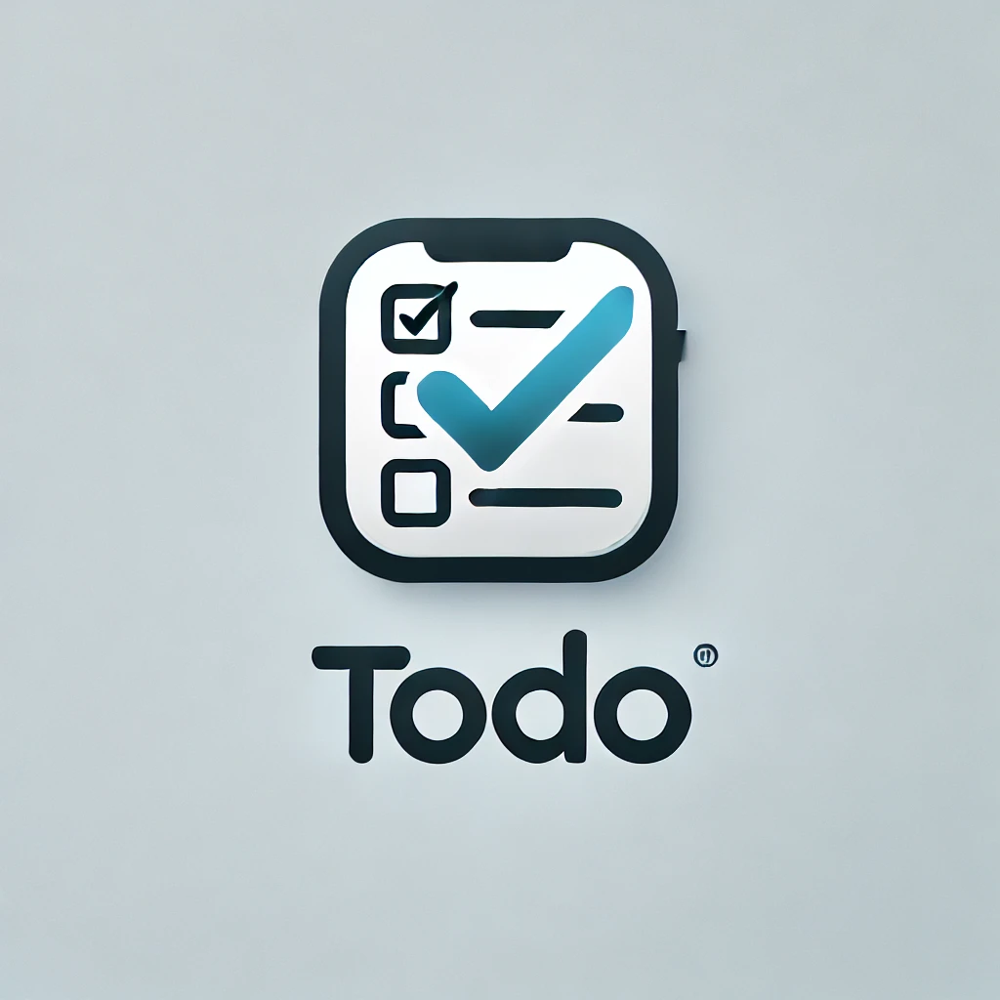

# DevOps Application

 <!-- Optional: Add your application logo -->

## Overview

This repository contains the source code and configuration files for the `yuvaldevops` DevOps application. This application is designed to streamline and automate various DevOps tasks, including CI/CD pipelines, infrastructure provisioning, monitoring, and logging.

## Architecture

Below is a high-level overview of the architecture of this application:


### Components

1. **CI/CD Pipeline**: Automates the process of code integration and deployment.
2. **Infrastructure as Code (IaC)**: Manages infrastructure using Terraform, Kubernetes manifests, and Helm charts.
3. **Monitoring and Logging**: Uses Prometheus, Grafana, and Loki to monitor and log application and infrastructure performance.
4. **Container Orchestration**: Kubernetes is used to manage containerized applications.
5. **Secret Management**: Securely manages secrets using HashiCorp Vault.

## Prerequisites

Before setting up this application, ensure you have the following installed:

- Docker
- Kubernetes (k3s, EKS, or any other distribution)
- Helm
- Terraform
- Git

## Setup

1. **Clone the Repository**
   ```bash
   git clone https://github.com/yourusername/yuvaldevops.git
   cd yuvaldevops
